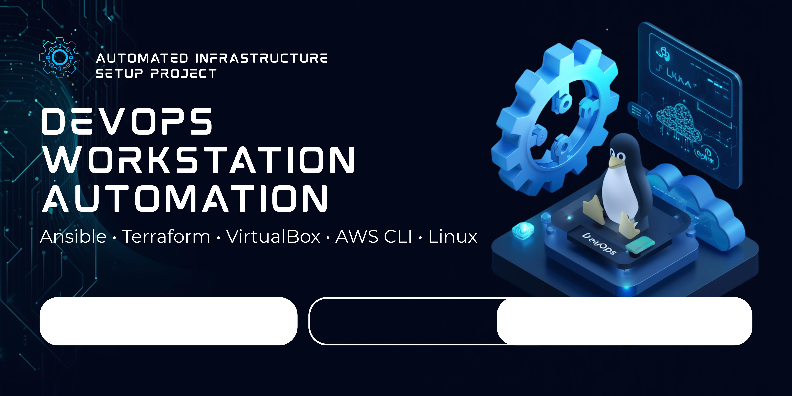

<!-- ===================== HEADER ===================== -->

  

<h1 align="center">🚀 DevOps Workstation Automation</h1>

Automated Linux DevOps environment setup using Ansible (Terraform • VirtualBox • AWS CLI)

---

# 📌 Overview

A fully automated **DevOps workstation setup project** that provisions a complete development environment using a single Ansible playbook.

Designed for:
- DevOps learning
- Infrastructure automation practice
- Portfolio showcase

---

# ⚙️ Tech Stack

- Ansible (Automation Engine)
- Linux (Xubuntu Host)
- VirtualBox (Virtualization)
- Terraform (Infrastructure as Code)
- Vagrant (VM Automation)
- AWS CLI (Cloud Access)

---

# 📦 Installed Tools

- Git
- Curl / Wget
- Vim / Htop
- Net-tools
- DNS utilities
- Traceroute
- Nmap
- Terraform
- Vagrant
- VirtualBox
- AWS CLI v2
- VS Code
- Brave Browser
- OnlyOffice

---
# 🏗️ Architecture

Host Machine (Xubuntu - Dell E7440)
|
|-- Ansible Playbook (Automation Engine)
|
|-- DevOps Tools Installed on Host
| |-- Terraform (IaC)
| |-- Vagrant (VM Automation)
| |-- VirtualBox (Virtualization)
| |-- AWS CLI (Cloud Access)
| |-- Git / VS Code
|
|-- VirtualBox Virtual Machines
|-- Docker Environment
|-- Jenkins CI/CD Server
|-- Grafana + Prometheus Monitoring
---
⚡ Features
⚡ One-command full setup
🔁 Idempotent (safe re-run)
🧩 Auto dependency handling
🛠️ VirtualBox kernel auto-repair
☁️ Cloud-ready CLI setup
💻 Lightweight host optimized
📂 Project Structure

 
Click to expand

ansible-setup/
├── inventory
├── setup.yml
└── README.md

🚀 How to Use
git clone https://github.com/muhammadkamrankabeer-oss/devops-workstation-automation.git
cd devops-workstation-automation
ansible-playbook -i inventory setup.yml --ask-become-pass
🔄 CI/CD (Future Ready)

 

CI/CD pipeline will be added using GitHub Actions for automation testing and validation.

📌 Learning Outcomes
Infrastructure as Code (IaC)
Linux system automation
DevOps toolchain setup
Virtualization management
Cloud CLI integration
Real-world automation practices
🧠 Future Improvements
Docker VM environment
Jenkins CI/CD pipeline
Prometheus + Grafana monitoring stack
Full Ansible roles structure
Terraform cloud provisioning
👨‍💻 Author

Muhammad Kamran Kabeer
DevOps Learner | Linux Enthusiast | Automation Explorer

⭐ Support

If you like this project:

⭐ Star the repository
🍴 Fork it
📢 Share on LinkedIn
