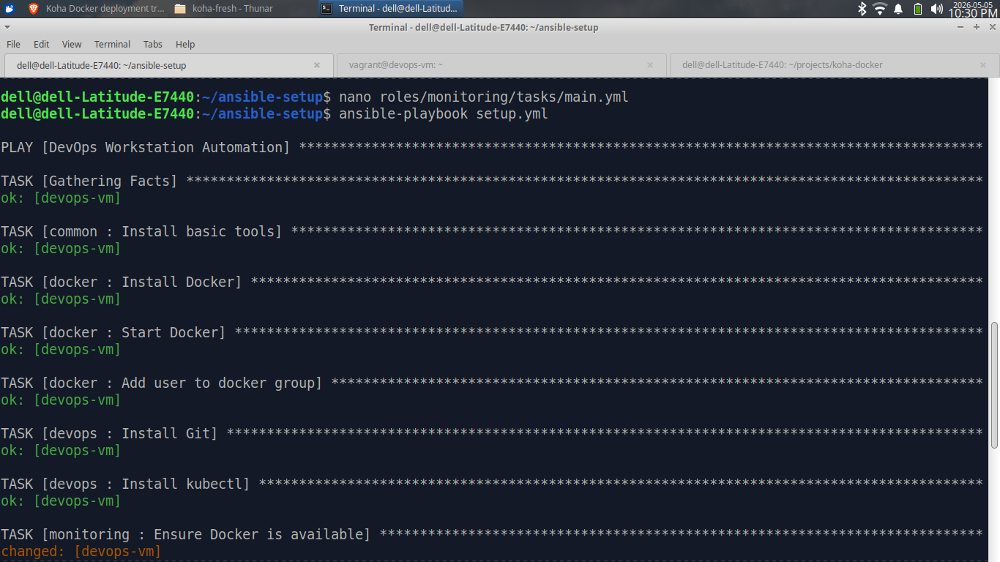
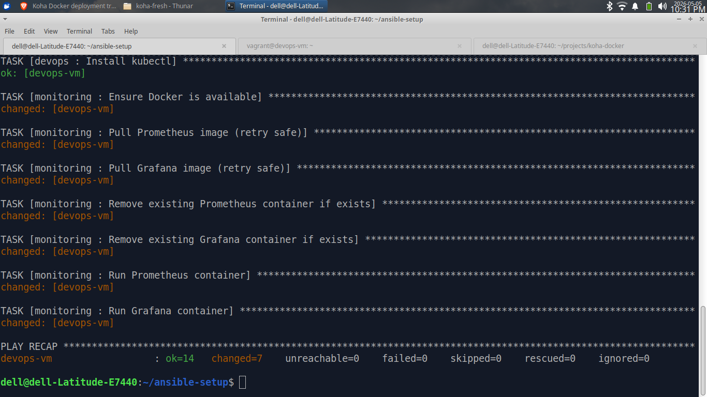

<!-- ===================== HEADER ===================== -->

<p align="center">
  
</p>

<h1 align="center">🚀 DevOps Workstation Automation</h1>

<p align="center">
Automated DevOps workstation provisioning using Ansible, KVM/libvirt, Docker, and Infrastructure as Code tools.
</p>

<p align="center">


</p>

---

## 📌 Overview

This project automates the provisioning of a complete DevOps workstation using Ansible and KVM virtualization.

The host operating system remains minimal and clean while all DevOps tooling and monitoring services are deployed inside isolated virtual machines.

The project follows a modular Infrastructure-as-Code (IaC) approach using:

* Ansible roles
* Vagrant provisioning
* KVM/libvirt virtualization
* Docker-based services

This setup improves reproducibility, isolation, and automation consistency for DevOps labs and learning environments.

---

# ⚙️ Tech Stack

* Ansible (Automation Engine)
* Linux (Xubuntu Host)
* KVM/libvirt (Virtualization)
* Terraform (Infrastructure as Code)
* Vagrant (VM Automation)
* Docker (Container Platform)
* Prometheus (Monitoring)
* Grafana (Visualization)

---

## 🏗️ Architecture

### Host Machine (Xubuntu)

* Git
* Ansible
* Terraform
* Vagrant
* KVM/libvirt

### Provisioned DevOps VM

* Docker
* kubectl
* Prometheus
* Grafana
* Development tools

### Automation Flow

```text
Host OS
   │
   ├── Ansible Control Node
   │
   ├── Vagrant / Terraform
   │
   └── KVM Virtual Machine
           │
           ├── Docker
           ├── Monitoring Stack
           ├── kubectl
           └── DevOps Tooling
```

---

## 🧩 Ansible Roles

| Role       | Purpose                               |
| ---------- | ------------------------------------- |
| common     | Base Linux tools and utilities        |
| docker     | Docker installation and configuration |
| devops     | DevOps tooling setup                  |
| monitoring | Prometheus and Grafana deployment     |

---

# 🔄 How It Works

1. User runs the Ansible playbook
2. System installs required DevOps tools
3. KVM/libvirt is configured automatically
4. Virtual machines are provisioned
5. Inside VMs:

   * Docker environment is prepared
   * Monitoring stack (Grafana + Prometheus) is deployed
   * Additional DevOps tooling can be added

---

## 🚀 How to Use

### Clone Repository

```bash
git clone https://github.com/muhammadkamrankabeer-oss/devops-workstation-automation.git
cd devops-workstation-automation
```

### Run Automation

```bash
ansible-playbook setup.yml
```

---

## 📸 Screenshots

### Ansible Automation Run



### DevOps Workstation Provisioning



### Grafana Monitoring Dashboard


---

## 🎯 Why This Project Matters

Setting up DevOps environments manually is time-consuming and error-prone.

This project demonstrates how automation can standardize infrastructure, reduce setup time, and improve reliability.

---

## 💼 Real-World Use Case

This setup can be used to:

* Quickly prepare DevOps lab environments
* Train students with real infrastructure
* Standardize team development environments
* Reduce onboarding time for new engineers

---

## ⚡ Features

* ⚡ One-command DevOps workstation provisioning
* 🧩 Modular Ansible role architecture
* 🔁 Idempotent automation (safe re-run)
* 🐳 Docker-based tooling inside isolated VM
* 📊 Automated monitoring stack deployment
* 🖥️ Clean host OS architecture
* ☁️ Infrastructure reproducibility
* 🔐 SSH-based remote automation
* 📦 Environment separation using KVM/libvirt

---

## 📂 Project Structure

```text
devops-workstation-automation/
├── ansible.cfg
├── inventory/
│   └── dev/
│       └── hosts.ini
├── provisioning/
│   ├── terraform/
│   └── vagrant/
├── roles/
│   ├── common/
│   ├── docker/
│   ├── devops/
│   └── monitoring/
├── assets/
├── setup.yml
└── README.md
```

---

## 🔄 CI/CD

This project includes a GitHub Actions pipeline that:

* Validates Ansible syntax
* Checks YAML formatting
* Runs automatically on push

---

# 📌 Learning Outcomes

* Infrastructure as Code (IaC)
* Linux automation
* DevOps toolchain setup
* Virtualization management
* Monitoring stack deployment
* Real-world automation practices

---

## 🧠 Future Improvements

* Terraform-based KVM VM provisioning
* Jenkins CI/CD pipeline integration
* Kubernetes local cluster automation
* Automated monitoring alerts
* Multi-environment inventory support
* GitHub Actions deployment validation

---

## 👨‍💻 Author

Muhammad Kamran Kabeer
DevOps Engineer | Linux | Automation

🌐 GitHub: [https://github.com/muhammadkamrankabeer-oss](https://github.com/muhammadkamrankabeer-oss)

💼 LinkedIn: [https://www.linkedin.com/in/muhammad-kamran-kabeer-b64740a4/](https://www.linkedin.com/in/muhammad-kamran-kabeer-b64740a4/)

---

## ⭐ Support

If you like this project:

* ⭐ Star the repository
* 🍴 Fork it
* 📢 Share on LinkedIn

---

## 🏷️ Tags

#devops #ansible #linux #automation #terraform #kvm #docker #monitoring #iac
