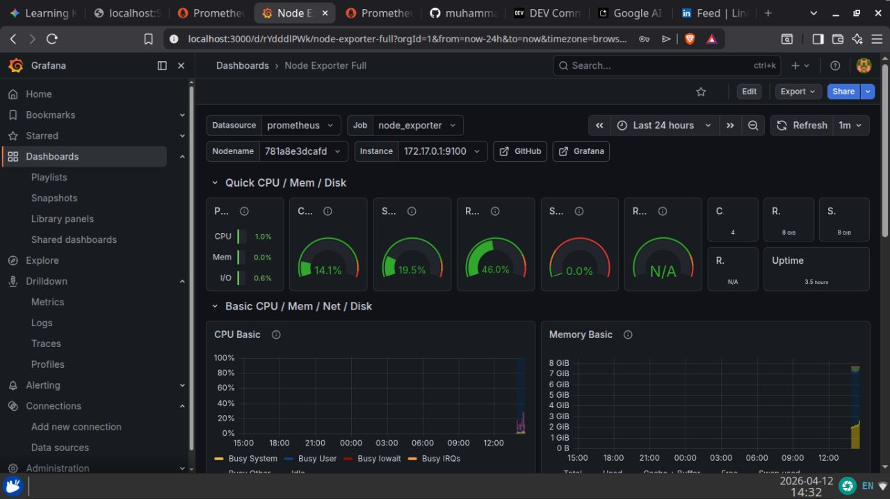

<!-- ===================== HEADER ===================== -->

<p align="center">
  
</p>

<h1 align="center">🚀 DevOps Workstation Automation</h1>

<p align="center">
Automated DevOps environment setup using Ansible (Terraform • VirtualBox • AWS CLI)
</p>

<p align="center">


</p>

---

# 📌 Overview

A **production-style DevOps workstation setup** automated using Ansible.

This project provisions a complete DevOps environment with a single command, reducing manual setup time and ensuring consistency.

---

# ⚙️ Tech Stack

- Ansible (Automation Engine)
- Linux (Xubuntu Host)
- VirtualBox (Virtualization)
- Terraform (Infrastructure as Code)
- Vagrant (VM Automation)
- AWS CLI (Cloud Access)

---

# 🏗️ Architecture

```
Host Machine (Xubuntu)
│
├── Ansible Playbook (Automation Engine)
│
├── DevOps Tools Installed
│ ├── Terraform
│ ├── Vagrant
│ ├── VirtualBox
│ ├── AWS CLI
│ └── Git / VS Code
│
└── Virtual Machines (VirtualBox)
├── Docker Environment
├── Jenkins CI/CD Server
└── Grafana + Prometheus Monitoring
```

---

# 🔄 How It Works

1. User runs Ansible playbook  
2. System installs required DevOps tools  
3. VirtualBox is configured automatically  
4. Virtual machines are provisioned  
5. Inside VMs:
   - Docker environment is prepared  
   - Jenkins CI/CD server can be deployed  
   - Monitoring stack (Grafana + Prometheus) can be added  

---

# 🚀 How to Use

```bash
git clone https://github.com/muhammadkamrankabeer-oss/devops-workstation-automation.git
cd devops-workstation-automation
ansible-playbook -i inventory setup.yml --ask-become-pass
```
---
📸 Demo (Add Screenshots)

Add screenshots inside assets/ folder

Example:



---
💼 Real-World Use Case

This setup can be used to:
Quickly prepare DevOps lab environments
Train students with real infrastructure
Standardize team development environments
Reduce onboarding time for new engineers
---
```
⚡ Features
⚡ One-command full setup
🔁 Idempotent (safe re-run)
🧩 Auto dependency handling
🛠️ VirtualBox kernel auto-repair
☁️ Cloud-ready CLI setup
💻 Lightweight host optimized
📂 Project Structure
```
---
```
ansible-setup/
├── inventory
├── setup.yml
└── README.md
```
---
```
🔄 CI/CD

This project includes a GitHub Actions pipeline that:

Validates Ansible syntax
Checks YAML formatting
Runs automatically on push
```
---
```
📌 Learning Outcomes
Infrastructure as Code (IaC)
Linux automation
DevOps toolchain setup
Virtualization management
Cloud CLI integration
Real-world automation practices
```
---
```
🧠 Future Improvements
Full Docker environment automation inside VMs
Jenkins pipeline automation
Prometheus + Grafana auto-deployment
Terraform cloud provisioning
```
---
```
👨‍💻 Author

Muhammad Kamran Kabeer
DevOps Engineer | Linux | Automation

🌐 GitHub https://github.com/muhammadkamrankabeer-oss

💼 LinkedIn https://www.linkedin.com/in/muhammad-kamran-kabeer-b64740a4/ 


```
---
⭐ Support
```
If you like this project:

⭐ Star the repository
🍴 Fork it
📢 Share on LinkedIn
```
---
🏷️ Tags

#devops #ansible #linux #automation #terraform #virtualbox #cloud
---
